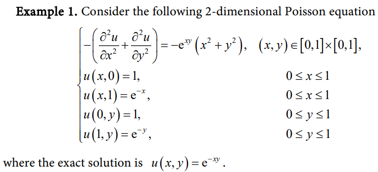

# Эксперимент

Эксперимент проводился с использованием `Ubuntu 22.04.3`, процессором `AMD Ryzen 5 5500U` и компилятором `gcc 11.4.0`.

Краевая задача взята из [статьи Guo, P.](https://www.scirp.org/pdf/jamp_2021120811364802.pdf)

Положим размера блока равным `BLOCK_SIZE` = `64` с точностью апроксимации `EPS` = `0.0001`.

В качестве первого приближения используем матрицу из нулей.

| Size of grid | Iterations | Time   | Acceleration | Threads |
| ------------ | ---------- | ------ | ------------ | ------- |
| 100          | 2566       | 0.17   | 1.00         | 1       |
| 100          | 2566       | 0.15   | 1.20         | 2       |
| 100          | 2566       | 0.20   | 0.87         | 4       |
| 100          | 2566       | 0.20   | 0.88         | 8       |
| 100          | 2566       | 0.53   | 0.33         | 12      |
| 200          | 4423       | 1.24   | 1.00         | 1       |
| 200          | 4423       | 0.90   | 1.38         | 2       |
| 200          | 4423       | 0.80   | 1.55         | 4       |
| 200          | 4423       | 0.88   | 1.40         | 8       |
| 200          | 4423       | 4.58   | 0.27         | 12      |
| 300          | 3537       | 2.28   | 1.00         | 1       |
| 300          | 3537       | 1.42   | 1.60         | 2       |
| 300          | 3537       | 1.12   | 2.04         | 4       |
| 300          | 3537       | 1.12   | 2.04         | 8       |
| 300          | 3537       | 1.37   | 1.67         | 12      |
| 400          | 3551       | 4.04   | 1.00         | 1       |
| 400          | 3551       | 2.47   | 1.63         | 2       |
| 400          | 3551       | 1.83   | 2.21         | 4       |
| 400          | 3551       | 1.62   | 2.49         | 8       |
| 400          | 3551       | 1.97   | 2.05         | 12      |
| 500          | 3558       | 6.47   | 1.00         | 1       |
| 500          | 3558       | 3.96   | 1.64         | 2       |
| 500          | 3558       | 2.67   | 2.42         | 4       |
| 500          | 3558       | 2.13   | 3.04         | 8       |
| 500          | 3558       | 2.66   | 2.44         | 12      |
| 600          | 3560       | 9.71   | 1.00         | 1       |
| 600          | 3560       | 5.93   | 1.64         | 2       |
| 600          | 3560       | 4.02   | 2.42         | 4       |
| 600          | 3560       | 3.07   | 3.16         | 8       |
| 600          | 3560       | 3.43   | 2.83         | 12      |
| 700          | 3561       | 13.81  | 1.00         | 1       |
| 700          | 3561       | 8.18   | 1.69         | 2       |
| 700          | 3561       | 5.58   | 2.48         | 4       |
| 700          | 3561       | 4.33   | 3.19         | 8       |
| 700          | 3561       | 4.96   | 2.78         | 12      |
| 800          | 3561       | 18.65  | 1.00         | 1       |
| 800          | 3561       | 10.69  | 1.74         | 2       |
| 800          | 3561       | 7.24   | 2.58         | 4       |
| 800          | 3561       | 5.78   | 3.23         | 8       |
| 800          | 3561       | 6.70   | 2.78         | 12      |
| 900          | 3561       | 24.16  | 1.00         | 1       |
| 900          | 3561       | 13.84  | 1.75         | 2       |
| 900          | 3561       | 9.64   | 2.51         | 4       |
| 900          | 3561       | 7.58   | 3.19         | 8       |
| 900          | 3561       | 8.83   | 2.74         | 12      |
| 1000         | 3562       | 30.58  | 1.00         | 1       |
| 1000         | 3562       | 17.31  | 1.77         | 2       |
| 1000         | 3562       | 11.40  | 2.68         | 4       |
| 1000         | 3562       | 9.25   | 3.30         | 8       |
| 1000         | 3562       | 10.29  | 2.97         | 12      |
| 2000         | 3562       | 126.58 | 1.00         | 1       |
| 2000         | 3562       | 70.17  | 1.80         | 2       |
| 2000         | 3562       | 41.89  | 3.02         | 4       |
| 2000         | 3562       | 30.08  | 4.21         | 8       |
| 2000         | 3562       | 33.98  | 3.73         | 12      |
| 3000         | 3562       | 325.99 | 1.00         | 1       |
| 3000         | 3562       | 188.05 | 1.73         | 2       |
| 3000         | 3562       | 108.89 | 2.99         | 4       |
| 3000         | 3562       | 68.45  | 4.76         | 8       |
| 3000         | 3562       | 72.09  | 4.52         | 12      |

Некоторые выводы:

- Данные показывают, что для наиболее эффективного использования ресурсов, например, 12-ти потоков, размер сетки должен быть порядка 3000 (экспериментально не удалось добраться до отметки, при которой 12 потоков использовались наиболее эффективно, но нетрудно заметить, что с увеличением размера сетки увеличение эффективности от бóльшего количества потоков становится более выраженным).
- Для малых размеров сетки затраты на безопасное распараллеливание превышают получаемый прирост производительности от задействования многопоточности.
- Результаты для сеток большого размера хорошо соотносятся с экспериментами, поставленными в работе "Высокопроизводительные вычисления для многоядерных многопроцессорных систем" — полученный прирост в производительности в данном эксперименте сопоставим с измерениями из книги.
- В пике удалось получить ускорение в `4.76` раз.
