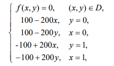

# Эксперимент

Эксперимент проводился с использованием `Ubuntu 22.04.3`, `AMD Ryzen 5 5500U 2.1GHz`, `16Гб ОЗУ (2666MHz)` и компилятором `gcc 11.4.0`. При компиляции использовались оптимизации компилятора (флаг `-O3`).

Некоторые вопросы, которые хотелось бы рассмотреть в этом эксперименте:
- При каких размерах сетки оверхэд на распараллеливание не перевешивает получаемое ускорение?
  
- Влияет ли выбор задачи на скорость работы алгоритма?

- Доверительный интервал времени выполнения разных задач.

<h2>Первая краевая задача</h2>

Условие

<a href="https://www.scirp.org/pdf/jamp_2021120811364802.pdf">Из статьи Guo, P.</a>

</img>

- Положим размера блока равным `BLOCK_SIZE` = `64` (величина выбрана именно так для более эффективного распараллеливания) с точностью апроксимации `EPS` = `0.0001`.

- В качестве первого приближения используем матрицу из нулей.

<h3>Результаты 10-ти замеров:</h3>

Табличка

| Size of grid | Iterations | Time (mean) | Acceleration (mean) | SD of time | Threads |
| ------------ | ---------- | ----------- | ------------------- | ---------- | ------- |
| 100          | 2566       | 0.08        | 1.00                | 0.0009     | 1       |
| 100          | 2566       | 0.07        | 1.14                | 0.0044     | 2       |
| 100          | 2566       | 0.09        | 0.90                | 0.0103     | 8       |
| 100          | 2566       | 0.13        | 0.62                | 0.0694     | 12      |
| 200          | 4423       | 0.55        | 1.00                | 0.0042     | 1       |
| 200          | 4423       | 0.42        | 1.30                | 0.0334     | 2       |
| 200          | 4423       | 0.43        | 1.26                | 0.0208     | 8       |
| 200          | 4423       | 0.52        | 1.05                | 0.0338     | 12      |
| 300          | 3537       | 0.99        | 1.00                | 0.0098     | 1       |
| 300          | 3537       | 0.66        | 1.50                | 0.0356     | 2       |
| 300          | 3537       | 0.55        | 1.78                | 0.0101     | 8       |
| 300          | 3537       | 0.66        | 1.50                | 0.0587     | 12      |
| 400          | 3551       | 1.79        | 1.00                | 0.0465     | 1       |
| 400          | 3551       | 1.14        | 1.57                | 0.0629     | 2       |
| 400          | 3551       | 0.79        | 2.27                | 0.0091     | 8       |
| 400          | 3551       | 0.97        | 1.84                | 0.1853     | 12      |
| 500          | 3558       | 2.98        | 1.00                | 0.0575     | 1       |
| 500          | 3558       | 1.80        | 1.66                | 0.0640     | 2       |
| 500          | 3558       | 1.10        | 2.70                | 0.0379     | 8       |
| 500          | 3558       | 1.40        | 2.13                | 0.1787     | 12      |
| 600          | 3560       | 4.70        | 1.00                | 0.1138     | 1       |
| 600          | 3560       | 2.78        | 1.69                | 0.1483     | 2       |
| 600          | 3560       | 1.59        | 2.95                | 0.0577     | 8       |
| 600          | 3560       | 1.83        | 2.57                | 0.1173     | 12      |
| 700          | 3561       | 6.61        | 1.00                | 0.2345     | 1       |
| 700          | 3561       | 4.34        | 1.52                | 0.2912     | 2       |
| 700          | 3561       | 2.70        | 2.45                | 0.2168     | 8       |
| 700          | 3561       | 2.81        | 2.35                | 0.1711     | 12      |
| 800          | 3561       | 8.86        | 1.00                | 0.4088     | 1       |
| 800          | 3561       | 5.98        | 1.48                | 0.2354     | 2       |
| 800          | 3561       | 4.25        | 2.09                | 0.7620     | 8       |
| 800          | 3561       | 4.44        | 1.99                | 0.6486     | 12      |
| 900          | 3561       | 11.39       | 1.00                | 0.9187     | 1       |
| 900          | 3561       | 7.82        | 1.46                | 0.4832     | 2       |
| 900          | 3561       | 5.75        | 1.98                | 1.0002     | 8       |
| 900          | 3561       | 6.42        | 1.77                | 1.7258     | 12      |
| 1000         | 3562       | 14.06       | 1.00                | 0.6939     | 1       |
| 1000         | 3562       | 9.69        | 1.45                | 0.2895     | 2       |
| 1000         | 3562       | 6.77        | 2.08                | 0.1288     | 8       |
| 1000         | 3562       | 7.92        | 1.77                | 1.1800     | 12      |
| 2000         | 3562       | 72.32       | 1.00                | 4.2843     | 1       |
| 2000         | 3562       | 40.78       | 1.77                | 1.6682     | 2       |
| 2000         | 3562       | 25.00       | 2.89                | 0.7335     | 8       |
| 2000         | 3562       | 27.27       | 2.65                | 1.5363     | 12      |
| 3000         | 3562       | 181.68      | 1.00                | 11.0173    | 1       |
| 3000         | 3562       | 107.47      | 1.69                | 13.8879    | 2       |
| 3000         | 3562       | 56.78       | 3.20                | 2.7362     | 8       |
| 3000         | 3562       | 66.19       | 2.75                | 17.0193    | 12      |

График

</img>

<h2>Вторая задача (из книги)</h2>

Условие

</img>

- Положим размера блока равным `BLOCK_SIZE` = `64` с точностью апроксимации `EPS` = `0.01`.

- В качестве первого приближения используем матрицу из нулей.
<h3>Результаты 10-ти замеров:</h3>

Табличка

| Size of grid | Iterations | Time (mean) | Acceleration (mean) | SD of time | Threads |
| ------------ | ---------- | ----------- | ------------------- | ---------- | ------- |
| 100          | 725        | 0.03        | 1.00                | 0.0012     | 1       |
| 100          | 725        | 0.02        | 1.12                | 0.0014     | 2       |
| 100          | 725        | 0.03        | 0.91                | 0.0012     | 8       |
| 100          | 725        | 0.16        | 0.16                | 0.3290     | 12      |
| 200          | 1497       | 0.19        | 1.00                | 0.0027     | 1       |
| 200          | 1497       | 0.15        | 1.30                | 0.0082     | 2       |
| 200          | 1497       | 0.15        | 1.26                | 0.0057     | 8       |
| 200          | 1497       | 0.21        | 0.92                | 0.0503     | 12      |
| 300          | 1980       | 0.57        | 1.00                | 0.0170     | 1       |
| 300          | 1980       | 0.39        | 1.48                | 0.0132     | 2       |
| 300          | 1980       | 0.33        | 1.76                | 0.0194     | 8       |
| 300          | 1980       | 0.50        | 1.15                | 0.1150     | 12      |
| 400          | 2293       | 1.23        | 1.00                | 0.0918     | 1       |
| 400          | 2293       | 0.76        | 1.63                | 0.0311     | 2       |
| 400          | 2293       | 0.53        | 2.30                | 0.0419     | 8       |
| 400          | 2293       | 0.79        | 1.57                | 0.1746     | 12      |
| 500          | 2509       | 2.24        | 1.00                | 0.1343     | 1       |
| 500          | 2509       | 1.38        | 1.63                | 0.1307     | 2       |
| 500          | 2509       | 0.85        | 2.63                | 0.1322     | 8       |
| 500          | 2509       | 1.67        | 1.35                | 1.5578     | 12      |
| 600          | 2667       | 3.78        | 1.00                | 0.3175     | 1       |
| 600          | 2667       | 2.32        | 1.63                | 0.2239     | 2       |
| 600          | 2667       | 1.39        | 2.72                | 0.2062     | 8       |
| 600          | 2667       | 2.22        | 1.70                | 1.1647     | 12      |
| 700          | 2787       | 5.47        | 1.00                | 0.3521     | 1       |
| 700          | 2787       | 3.66        | 1.49                | 0.3972     | 2       |
| 700          | 2787       | 2.46        | 2.22                | 0.4984     | 8       |
| 700          | 2787       | 4.71        | 1.16                | 4.1521     | 12      |
| 800          | 2880       | 7.69        | 1.00                | 0.7149     | 1       |
| 800          | 2880       | 5.45        | 1.41                | 1.0850     | 2       |
| 800          | 2880       | 3.61        | 2.13                | 0.4277     | 8       |
| 800          | 2880       | 4.26        | 1.81                | 0.7024     | 12      |
| 900          | 2955       | 10.08       | 1.00                | 0.8827     | 1       |
| 900          | 2955       | 6.96        | 1.45                | 0.7462     | 2       |
| 900          | 2955       | 5.03        | 2.00                | 0.6393     | 8       |
| 900          | 2955       | 6.36        | 1.59                | 1.1359     | 12      |
| 1000         | 3017       | 12.90       | 1.00                | 1.2398     | 1       |
| 1000         | 3017       | 8.63        | 1.49                | 0.6334     | 2       |
| 1000         | 3017       | 6.19        | 2.08                | 0.5313     | 8       |
| 1000         | 3017       | 10.28       | 1.25                | 5.6083     | 12      |
| 2000         | 3314       | 78.09       | 1.00                | 12.9455    | 1       |
| 2000         | 3314       | 42.92       | 1.82                | 4.7827     | 2       |
| 2000         | 3314       | 26.66       | 2.93                | 3.8081     | 8       |
| 2000         | 3314       | 34.00       | 2.30                | 8.8069     | 12      |
| 3000         | 3421       | 193.96      | 1.00                | 22.8276    | 1       |
| 3000         | 3421       | 106.40      | 1.82                | 9.6622     | 2       |
| 3000         | 3421       | 58.30       | 3.33                | 5.3227     | 8       |
| 3000         | 3421       | 67.52       | 2.87                | 8.4885     | 12      |

График

</img>

---

<b>Некоторые выводы:</b>

- Данные показывают, что для наиболее эффективного использования ресурсов, например, 12-ти потоков, размер сетки должен быть порядка 3000 (экспериментально не удалось добраться до отметки, при которой 12 потоков использовались наиболее эффективно, но нетрудно заметить, что с увеличением размера сетки увеличение эффективности от бóльшего количества потоков становится более выраженным).
- Для малых размеров сетки затраты на безопасное распараллеливание превышают получаемый прирост производительности от задействования многопоточности.
- Результаты для сеток большого размера хорошо соотносятся с экспериментами, поставленными в работе "Высокопроизводительные вычисления для многоядерных многопроцессорных систем" — полученный прирост в производительности в данном эксперименте сопоставим с измерениями из книги.
- В пике удалось получить ускорение в `3.33` раза.
- При использовании меньшего количества потоков стандартное отклонение наименьшее — порядка 7%, что понятно, ведь равномерное распределение работы проще обеспечить на одном потоке. Хотя заметен небольшой рост (вплоть до 12%) при увеличении объема вычислений. Для множества потоков СО колеблется — от 10 до 25%, что может быть связано с тем, что ОС не всегда выделяет ресурсы потокам равномерно.
- Выбор задачи существенен. N.B.: Параметры эксперимента намеренно подобраны таким образом, чтобы время выполнения на больших сетках было скореллировано (был один порядок времени выполнения). При разной желаемой точности (EPS) может потребоваться достаточно ощутимо больше или меньше времени для выполнения.
