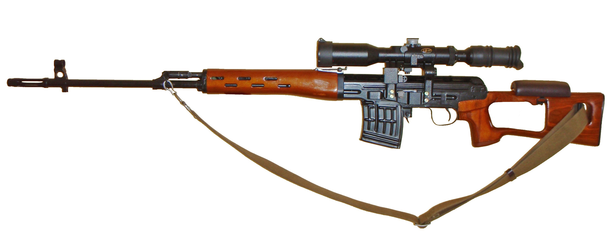

# Сингулярное разложение и сжатие изображений

<h1> Описание формата результата сжатия изображения: </h1>

| Structure name | Type           | Purpose                               |
| -------------- | -------------- | ------------------------------------- |
| m              | int32          | Width of origin image                 |
| n              | int32          | Height of origin image                |
| k              | int32          | Rank of factorization                 |
| U              | float32[m * k] | The U component of SVD factorization  |
| S              | float32[k]     | The S component of SVD factorization  |
| Vh             | float32[k * n] | The Vh component of SVD factorization |

<h1> Реализация алгоритма SVD:</h1>

1. `numpy` (mode=numpy)
2. `Randomized range finder` (mode=advanced)
3. `Power method` (mode=simple)

<h1>Использование</h1>

| Flag        | Description                     |
| ----------- | ------------------------------- |
| mode        | "compress" or "decompress"      |
| method      | "numpy", "simple" or "advanced" |
| compression | Image compression ratio         |
| path        | Path to image to compress       |
| binpath     | Path to compression result      |
| bmppath     | Path to decompression result    |

<h1>Исследование реализаций</h1>
<h2>Теоретические ожидания</h2>

1. `numpy` должен давать показывать лучшую производительность и точность
2. `advanced` алгоритм должен сходиться гораздо быстрее `simple`, но будет медленнее `numpy`, вероятно, и менее точным из-за недетерминированности.
3. `simple` должен быть медленнее, но достаточно точным, как numpy (с выбранной точностью сходимости).
<h2>Метод</h2>
Для каждого изображения сгенерируем матрицу: посчитаем разницу между исходным и сжатым вариантом (т.е. c_ij = |a_ij - b_ij|), а также по каждому каналу возьмем евклидову норму и посчитаем сумму (такая "норма" для трехмерной матрицы выбрана так, чтобы она отражала отклонение по каждому из каналов). Чем больше матрица будет похожа на полностью черную, тем меньше метод сжатия теряет данные.

<h3>1. Большое изображение. Степень сжатия = 2.</h3>

[Результаты замеров.](./results/SVD_2.0/info.txt)

<table>
  <tr>
    <td>origin</td>
     <td>numpy</td>
     <td>advanced</td>
     <td>simple</td>
  </tr>
  <tr>
    <td></td>
    <td></td>
    <td></td>
    <td></td>
  </tr>
  <tr>
    <td>Total black</td>
    <td></td>
    <td></td>
    <td></td>
  </tr>
 </table>

Как и ожидалось, numpy оказался на порядок быстрее, результаты для примитивного и numpy алгоритмов сошлись. Общее содержание изображения осталось узнаваемым даже после сжатий.

<h3>2. Разреженная матрица. Степень сжатия = 2.</h3>

[Результаты замеров.](./results/sparse_image_2.0/info.txt)

<table>
  <tr>
    <td>origin</td>
     <td>numpy</td>
     <td>advanced</td>
     <td>simple</td>
  </tr>
  <tr>
    <td></td>
    <td></td>
    <td></td>
    <td></td>
  </tr>
  <tr>
    <td>Total black</td>
    <td></td>
    <td></td>
    <td></td>
  </tr>
 </table>

`Advanced` алгоритм показал себя лучше в качестве приближения исходной матрицы, чем другие, что ожидаемо, т.к. он лучше подходит для работы с разреженными матрицами.

<h3>3. Маленькое изображение. Степень сжатия = 2.</h3>

[Результаты замеров.](./results/small_2.0/info.txt)

<table>
  <tr>
    <td>origin</td>
     <td>numpy</td>
     <td>advanced</td>
     <td>simple</td>
  </tr>
  <tr>
    <td></td>
    <td></td>
    <td></td>
    <td></td>
  </tr>
  <tr>
    <td>Total black</td>
    <td></td>
    <td></td>
    <td></td>
  </tr>
 </table>

Изображение испортилась и получилось что-то едва различимое от исходного. Возможно, из-за слишком низкого выбранного ранга матрицы и низкого разрешения изображения.

<h3>4. Степень сжатия = 2.</h3>

[Результаты замеров.](./results/kot_2.0/info.txt)

<table>
  <tr>
    <td>origin</td>
     <td>numpy</td>
     <td>advanced</td>
     <td>simple</td>
  </tr>
  <tr>
    <td></td>
    <td></td>
    <td></td>
    <td></td>
  </tr>
  <tr>
    <td>Total black</td>
    <td></td>
    <td></td>
    <td></td>
  </tr>
 </table>

`advanced` оказался быстрее даже `numpy`, хотя приблизил изначальное изображение не очень качественно.
